# Delineate - CUET Micro-Ops Hackathon 2025 Submission

[](https://github.com/bongodev/cuet-micro-ops-hackthon-2025/actions/workflows/ci.yml)

> A production-ready file download microservice with S3 storage, observability, and CI/CD pipeline - built for the CUET Fest 2025 Hackathon.

**Demo Video:** [Watch Demo](images/gif.mp4)

**Original Challenge Requirements:** See [`README(Given).md`](./README(Given).md) for the complete hackathon challenge description.

---

## Challenge Summary

| Challenge                           | Max Points | Status    |
| ----------------------------------- | ---------- | --------- |
| Challenge 1: S3 Storage Integration | 15         | Completed |
| Challenge 2: Architecture Design    | 15         | Completed |
| Challenge 3: CI/CD Pipeline         | 10         | Completed |
| Challenge 4: Observability (Bonus)  | 10         | Completed |
| **Total**                           | **50**     |           |

---

## The Problem

This microservice simulates a **real-world file download system** with variable processing times:

```
┌─────────────────────────────────────────────────────────────────────────┐
│                        Download Processing Time                         │
├─────────────────────────────────────────────────────────────────────────┤
│  Fast Downloads    ████████░░░░░░░░░░░░░░░░░░░░░░░░░░░░░░░░  ~10-15s    │
│  Medium Downloads  ████████████████████░░░░░░░░░░░░░░░░░░░░  ~30-60s    │
│  Slow Downloads    ████████████████████████████████████████  ~60-120s   │
└─────────────────────────────────────────────────────────────────────────┘
```

**Why does this matter?**

When deployed behind a reverse proxy (Cloudflare, nginx, AWS ALB), you encounter:

| Problem                 | Impact                                        |
| ----------------------- | --------------------------------------------- |
| **Connection Timeouts** | Cloudflare's 100s timeout kills long requests |
| **Gateway Errors**      | Users see 504 errors for slow downloads       |
| **Poor UX**             | No progress feedback during long waits        |
| **Resource Waste**      | Open connections consume server memory        |

---

## Solutions Implemented

### Challenge 1: S3 Storage Integration

**Self-hosted S3-compatible storage using RustFS**

- Added RustFS service to Docker Compose (dev & prod)
- Automatic bucket creation via init container
- Proper networking between services
- Health endpoint returns `{"status": "healthy", "checks": {"storage": "ok", "redis": "ok"}}`
- Circuit breaker for S3 operations (5s timeout, 30s reset)
- Redis job storage with TTL for async download jobs

**Files Modified:**

- `docker/compose.dev.yml`
- `docker/compose.prod.yml`
- `src/index.js` (circuit breaker, Redis integration)

```bash
# Verify storage integration
curl http://localhost:3000/health
# Expected: {"status":"healthy","checks":{"storage":"ok","redis":"ok"}}
```

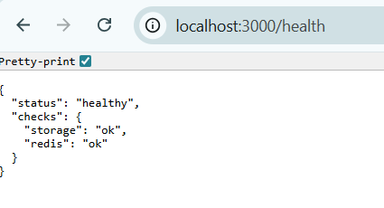

**RustFS Console showing S3 bucket:**

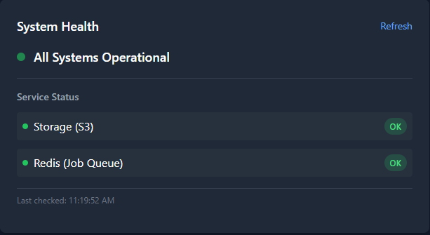

**File stored in RustFS:**

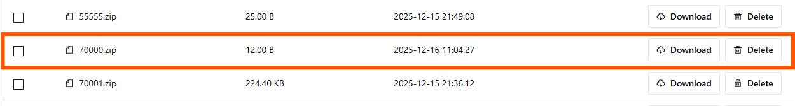

### Challenge 2: Architecture Design

**Polling Pattern (Option A) for long-running downloads**

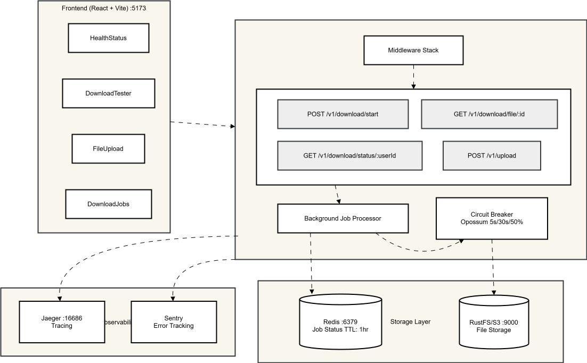

**Data Flow:**

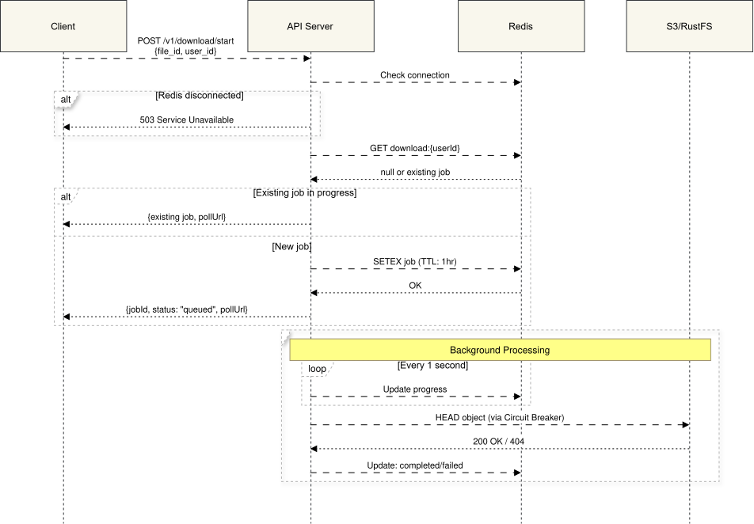

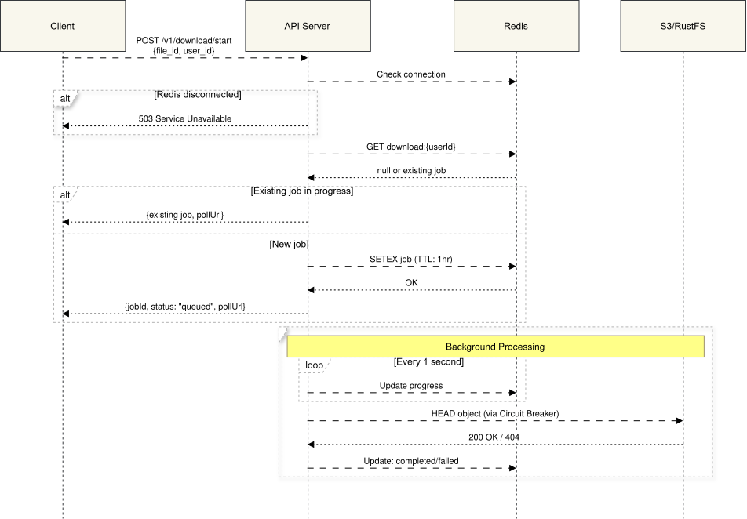

See [`ARCHITECTURE.md`](./ARCHITECTURE.md) for the complete design including:

- Architecture diagrams for fast/slow download paths
- API contract with async endpoints (`/start`, `/status/:userId`)
- Redis schema for job tracking with TTL
- Circuit breaker for S3 resilience (Opossum library)
- Proxy configurations (nginx, Cloudflare)
- Frontend React dashboard with polling and progress display

**Key Implementation Details:**

| Component        | Technology     | Purpose                               |
| ---------------- | -------------- | ------------------------------------- |
| Job Storage      | Redis with TTL | Store job status (1 hour TTL)         |
| Circuit Breaker  | Opossum        | S3 resilience (5s timeout, 30s reset) |
| Progress Updates | Polling (2s)   | Frontend polls `/status/:userId`      |
| Failure Handling | 503 responses  | Redis/S3 failures return 503          |

### Challenge 3: CI/CD Pipeline

**GitHub Actions pipeline with 4 stages**

```
┌─────────────┐    ┌─────────────┐    ┌─────────────┐    ┌─────────────┐
│    Lint     │───▶│    Test     │───▶│    Build    │    │  Security   │
│  (ESLint,   │    │   (E2E)     │    │  (Docker)   │    │   (CodeQL)  │
│  Prettier)  │    │             │    │             │    │             │
└─────────────┘    └─────────────┘    └─────────────┘    └─────────────┘
```

**Features:**

- Triggers on push to `main`/`master`/`dev` and pull requests
- npm dependency caching
- Docker image build with layer caching
- CodeQL security analysis
- npm audit for vulnerability detection
- Concurrency control (cancels redundant runs)

**File:** `.github/workflows/ci.yml`

**E2E Test Results:**

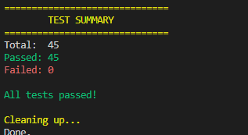

**Command Line Download Test:**

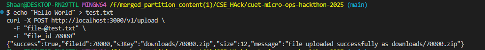

### Challenge 4: Observability Dashboard

**React + Vite dashboard with Sentry & OpenTelemetry**

| Feature             | Description                                    |
| ------------------- | ---------------------------------------------- |
| Health Status       | Real-time API health monitoring                |
| Download Jobs       | Track download job status and progress         |
| Error Log           | View errors captured by Sentry                 |
| Trace Viewer        | Link to Jaeger UI for distributed tracing      |
| Performance Metrics | API response times and success rates           |
| Download Tester     | Test download functionality with trace context |

**End-to-end tracing:**

```
Frontend (trace-id: abc123)
    │
    ▼ traceparent header
Backend logs: [trace_id=abc123]
    │
    ▼
Jaeger UI: View complete trace
```

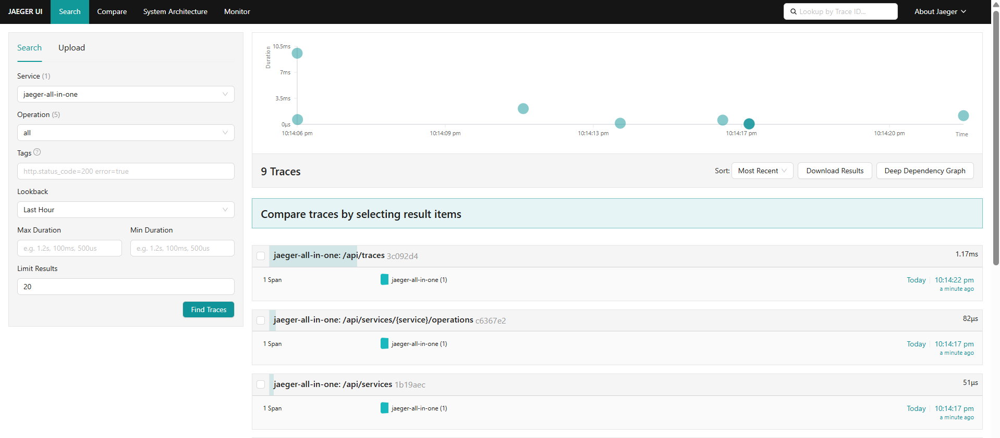

**Sentry Error Tracking:**

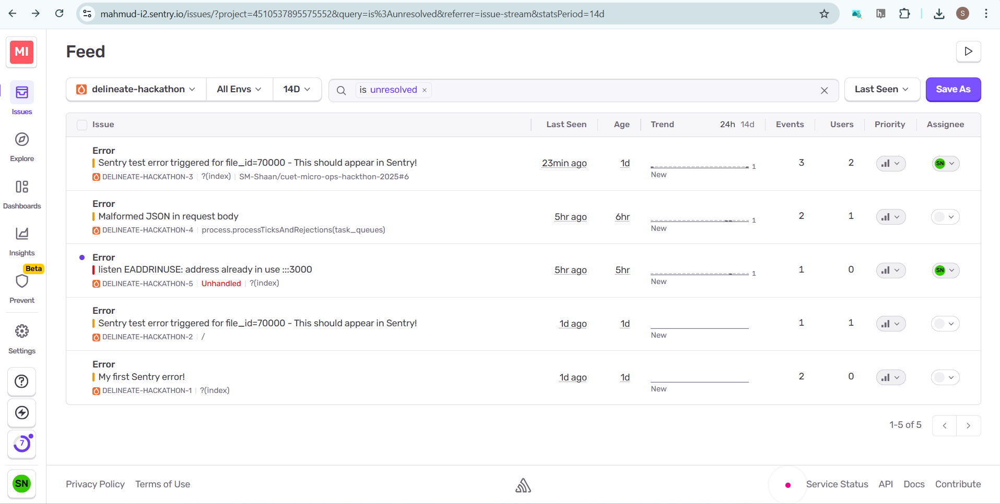

**Directory:** `frontend/`

---

## API Testing & Implementation Verification

This section provides comprehensive testing commands to verify all hackathon challenges are properly implemented.

### Challenge 1: S3 Storage Integration Testing

#### Step 1: Start the Docker Environment

```bash
# Start development environment with all services
npm run docker:dev

# Wait for services to be ready (approximately 15-20 seconds)
# Check container status
docker ps
```

#### Step 2: Verify Health Endpoint (Storage Status)

```bash
# Test health endpoint - MUST return storage: "ok" and redis: "ok"
curl -s http://localhost:3000/health

# Expected Response:
# {
#   "status": "healthy",
#   "checks": {
#     "storage": "ok",
#     "redis": "ok"
#   }
# }
```

#### Step 3: Verify S3 Bucket Creation

```bash
# Check if 'downloads' bucket exists in RustFS
curl -s http://localhost:9000/minio/health/live

# Access RustFS Console to verify bucket
# Open: http://localhost:9001
# Login: rustfsadmin / rustfsadmin
# Verify 'downloads' bucket exists
```

#### Step 4: Test File Download Check

```bash
# Check file availability (should work with S3 connection)
curl -s -X POST http://localhost:3000/v1/download/check \
  -H "Content-Type: application/json" \
  -d '{"file_id": 70000}' | jq

# Expected: Returns file check status
```

#### Step 5: Run E2E Tests

```bash
# Run full E2E test suite (validates S3 integration)
npm run test:e2e
```

---

### Challenge 2: Architecture Design Verification

The architecture design is documented in `ARCHITECTURE.md`. Verify the implementation:

#### Verify API Contract Endpoints

```bash
# 1. Test root endpoint
curl -s http://localhost:3000/

# Expected Response:
# {"message":"Hello Hono!"}

# 2. Test initiate bulk download
curl -s -X POST http://localhost:3000/v1/download/initiate \
  -H "Content-Type: application/json" \
  -d '{"file_ids": [70000, 70001, 70002]}'

# Expected Response:
# {
#   "jobId": "uuid-here",
#   "status": "queued",
#   "totalFileIds": 3
# }

# 3. Test single file check
curl -s -X POST http://localhost:3000/v1/download/check \
  -H "Content-Type: application/json" \
  -d '{"file_id": 70000}'

# Expected Response:
# {
#   "file_id": 70000,
#   "available": false,
#   "s3Key": null,
#   "size": null
# }

# 4. Test download start (async - returns immediately)
curl -s -X POST http://localhost:3000/v1/download/start \
  -H "Content-Type: application/json" \
  -d '{"file_id": 70000, "user_id": "test-user-123"}'

# Expected Response (returns immediately):
# {
#   "jobId": "uuid-here",
#   "userId": "test-user-123",
#   "fileId": 70000,
#   "status": "queued",
#   "message": "Download job queued. Poll the status URL for updates.",
#   "pollUrl": "/v1/download/status/test-user-123"
# }

# 5. Poll download status
curl -s http://localhost:3000/v1/download/status/test-user-123

# Expected Response (when processing):
# {
#   "jobId": "uuid",
#   "userId": "test-user-123",
#   "fileId": 70000,
#   "status": "processing",
#   "progress": 50,
#   "createdAt": 1234567890,
#   "updatedAt": 1234567891,
#   ...
# }

# Expected Response (when completed):
# {
#   "jobId": "uuid",
#   "userId": "test-user-123",
#   "fileId": 70000,
#   "status": "completed",
#   "progress": 100,
#   "downloadUrl": "presigned-s3-url",
#   ...
# }
```

#### Verify OpenAPI Documentation

```bash
# Access OpenAPI spec
curl -s http://localhost:3000/openapi | jq

# Access Scalar API Documentation UI
# Open: http://localhost:3000/docs
```

#### Verify Request Timeout Handling

```bash
# Test with production delays (10-120s) - demonstrates timeout issue
npm run start &

# This request may timeout (demonstrates the problem)
timeout 35 curl -s -X POST http://localhost:3000/v1/download/start \
  -H "Content-Type: application/json" \
  -d '{"file_id": 70000}'

# Server logs will show:
# [Download] Starting file_id=70000 | delay=XXs (range: 10s-120s) | enabled=true
```

---

### Challenge 3: CI/CD Pipeline Testing

#### Step 1: Verify Local Lint & Format

```bash
# Run ESLint (must pass with no errors)
npm run lint

# Check code formatting
npm run format:check
```

#### Step 2: Run E2E Tests Locally

```bash
# Run full E2E test suite
npm run test:e2e
```

#### Step 3: Build Docker Image

```bash
# Build production Docker image
docker build -t delineate-test -f docker/Dockerfile.prod .

# Alternatively, use npm script
npm run docker:prod

# Verify image was created
docker images | grep delineate
```

#### Step 4: Verify CI Configuration

```bash
# View CI workflow configuration
cat .github/workflows/ci.yml

# Key stages to verify:
# - lint: ESLint + Prettier check
# - test: E2E tests
# - build: Docker image build
# - security: CodeQL + npm audit
```
---

### Challenge 4: Observability Dashboard Testing

#### Step 1: Start Full Stack with Docker

```bash
# Start all services including frontend dashboard
npm run docker:dev

# Wait for all containers to be ready (15-20 seconds)
docker ps

# Expected containers:
# - delineate-delineate-app-1        (port 3000)
# - delineate-delineate-dashboard-1  (port 5173)
# - delineate-delineate-jaeger-1     (ports 16686, 4318)
# - delineate-rustfs-1               (ports 9000, 9001)
# - delineate-redis-1                (port 6379) - for job queue
```

#### Step 2: Verify Dashboard Access

```bash
# Test dashboard is accessible
curl -s -o /dev/null -w "%{http_code}" http://localhost:5173

# Expected: 200

# Open in browser: http://localhost:5173
```

#### Step 3: Verify Jaeger Tracing

```bash
# Test Jaeger UI is accessible
curl -s -o /dev/null -w "%{http_code}" http://localhost:16686

# Expected: 200

# Open Jaeger UI: http://localhost:16686
# Select service: "delineate-api" to view traces
```

#### Step 4: Test Sentry Error Tracking

```bash
# Trigger intentional error for Sentry testing
curl -s -X POST "http://localhost:3000/v1/download/check?sentry_test=true" \
  -H "Content-Type: application/json" \
  -d '{"file_id": 70000}'

# Expected Response:
# {
#   "error": "Internal Server Error",
#   "message": "Sentry test error triggered for file_id=70000 - This should appear in Sentry!",
#   "requestId": "uuid-here"
# }

# If SENTRY_DSN is configured, this error appears in Sentry dashboard
```

#### Step 5: Verify Trace Propagation

```bash
# Make request with trace context header
curl -s -X POST http://localhost:3000/v1/download/check \
  -H "Content-Type: application/json" \
  -H "traceparent: 00-4bf92f3577b34da6a3ce929d0e0e4736-00f067aa0ba902b7-01" \
  -d '{"file_id": 70000}' | jq

# Check Jaeger UI for trace with ID: 4bf92f3577b34da6a3ce929d0e0e4736
# Open: http://localhost:16686/trace/4bf92f3577b34da6a3ce929d0e0e4736
```

#### Step 6: Test Dashboard Features

Open http://localhost:5173 and verify:

| Feature             | How to Test                                      |
| ------------------- | ------------------------------------------------ |
| Health Status       | Check green status indicator on dashboard        |
| Download Tester     | Enter File ID, click "Start Download" button     |
| Progress Bar        | Watch progress update 0% -> 100% during download |
| Error Log           | Trigger Sentry test error, check error list      |
| Trace Viewer        | Click "View in Jaeger" link after a request      |
| Performance Metrics | Make several requests, observe response times    |

**Download Flow in Frontend:**

1. Enter a File ID (e.g., 70000)
2. Click "Start Download"
3. Watch progress bar update in real-time
4. Final status shows "completed" (with download URL) or "failed" (with error message)

> **Note:** File 70000 doesn't exist in S3, so downloads will complete with "File not found" message. This is **expected behavior** and demonstrates the async polling flow is working correctly. The progress bar updates from 0% → 100%, then shows the final status.

#### Upload a Test File (Optional - for successful download)

To test a successful download with an actual file:

```bash
# 1. Create a test file
echo "Hello, this is test file 70000" > /tmp/testfile.txt

# 2. Upload to RustFS using mc (MinIO Client)
docker exec -it delineate-rustfs-init-1 mc cp /tmp/testfile.txt myrustfs/downloads/70000

# Or using curl with presigned URL (if available)
# Then test download - it should complete with downloadUrl
```

---

---

### Production Mode Testing

```bash
# Start production environment
npm run docker:prod

# Test through API Gateway (nginx)
curl -s http://localhost/health | jq
curl -s http://localhost/v1/download/check \
  -X POST \
  -H "Content-Type: application/json" \
  -d '{"file_id": 70000}' | jq

# Access dashboard through gateway
# Open: http://localhost
```

---

## Quick Start

### Prerequisites

| Requirement    | Version    |
| -------------- | ---------- |
| Node.js        | >= 24.10.0 |
| npm            | >= 10.x    |
| Docker         | >= 24.x    |
| Docker Compose | >= 2.x     |

### Local Development

```bash
# Install dependencies
npm install

# Create environment file
cp .env.example .env

# Start development server (5-15s delays, hot reload)
npm run dev

# Or start production server (10-120s delays)
npm run start
```

Server: http://localhost:3000

- API Documentation: http://localhost:3000/docs
- OpenAPI Spec: http://localhost:3000/openapi

### Using Docker

```bash
# Development mode (with Jaeger tracing)
npm run docker:dev

# Production mode (with API Gateway)
npm run docker:prod
```

**Development Access Points:**
| Service | URL |
| --------- | ---------------------- |
| Dashboard | http://localhost:5173 |
| API | http://localhost:3000 |
| Jaeger UI | http://localhost:16686 |
| RustFS | http://localhost:9001 |

**Production Access Points:**
| Service | URL |
| ----------- | ------------------ |
| API Gateway | http://localhost |

---

## Tech Stack

| Component      | Technology                                          |
| -------------- | --------------------------------------------------- |
| Runtime        | Node.js 24 with native TypeScript support           |
| Framework      | [Hono](https://hono.dev) - Ultra-fast web framework |
| Validation     | [Zod](https://zod.dev) with OpenAPI integration     |
| Storage        | RustFS (S3-compatible)                              |
| Observability  | OpenTelemetry + Jaeger                              |
| Error Tracking | Sentry                                              |
| Documentation  | Scalar OpenAPI UI                                   |
| Frontend       | React + Vite + TailwindCSS                          |

---

## Project Structure

```
.
├── src/
│   ├── index.js              # Main API (circuit breaker, Redis, S3)
│   └── instrument.js         # OpenTelemetry + Sentry setup
├── frontend/                 # Observability Dashboard (React + Vite)
│   ├── src/
│   │   ├── components/       # HealthStatus, DownloadTester, FileUpload
│   │   ├── hooks/            # Custom React hooks
│   │   └── lib/              # Sentry & OpenTelemetry setup
│   ├── Dockerfile            # Frontend Docker build
│   └── package.json
├── scripts/
│   ├── e2e-test.js           # E2E test suite (45 tests)
│   ├── run-e2e.js            # Test runner with server management
│   ├── quick-test.js         # Quick health verification (11 tests)
│   └── resilience-test.sh    # Redis/S3 failure testing
├── docs/
│   ├── CHALLENGE-1-COMPLETE.md    # Challenge 1: S3 integration guide
│   ├── CHALLENGE-2-COMPLETE.md    # Challenge 2: Project documentation
│   ├── CHALLENGE-2-CONCEPTS.md    # Challenge 2: Conceptual guide
│   ├── TESTING_GUIDE.md           # Complete testing instructions
│   ├── DOWNLOAD_API.md            # API documentation
│   └── FUTURE_WORK.md             # Production roadmap
├── docker/
│   ├── Dockerfile.dev        # Development Dockerfile
│   ├── Dockerfile.prod       # Production Dockerfile
│   ├── compose.dev.yml       # Development Docker Compose
│   └── compose.prod.yml      # Production Docker Compose
├── .github/
│   └── workflows/
│       └── ci.yml            # GitHub Actions CI pipeline
├── ARCHITECTURE.md           # Long-running download architecture design
├── SUBMISSION.md             # Hackathon submission summary
├── README(Given).md          # Original hackathon challenge requirements
├── package.json
├── tsconfig.json
└── eslint.config.mjs
```

---

## API Endpoints

| Method | Endpoint                       | Description                              |
| ------ | ------------------------------ | ---------------------------------------- |
| GET    | `/`                            | Welcome message                          |
| GET    | `/health`                      | Health check (S3, Redis, circuit status) |
| GET    | `/docs`                        | API documentation (Scalar UI)            |
| POST   | `/v1/download/initiate`        | Initiate bulk download job               |
| POST   | `/v1/download/check`           | Check single file availability           |
| POST   | `/v1/download/start`           | Start async download job                 |
| GET    | `/v1/download/status/{userId}` | Poll download job status & progress      |
| GET    | `/v1/download/file/{fileId}`   | Download file from S3                    |
| POST   | `/v1/upload`                   | Upload file to S3                        |
| GET    | `/v1/files`                    | List files in S3 bucket                  |

### Testing Downloads

```bash
# With dev server running
npm run dev

# Start a download job (returns immediately)
curl -X POST http://localhost:3000/v1/download/start \
  -H "Content-Type: application/json" \
  -d '{"file_id": 70000, "user_id": "my-user-id"}'

# Poll for status (check progress)
curl http://localhost:3000/v1/download/status/my-user-id

# Test Sentry integration
curl -X POST "http://localhost:3000/v1/download/check?sentry_test=true" \
  -H "Content-Type: application/json" \
  -d '{"file_id": 70000}'
```

---

## Environment Variables

Create a `.env` file in the project root:

```env
# Server
NODE_ENV=development
PORT=3000

# S3 Configuration
S3_REGION=us-east-1
S3_ENDPOINT=http://localhost:9000
S3_ACCESS_KEY_ID=rustfsadmin
S3_SECRET_ACCESS_KEY=rustfsadmin
S3_BUCKET_NAME=downloads
S3_FORCE_PATH_STYLE=true

# Observability
SENTRY_DSN=                                    # Your Sentry DSN
OTEL_EXPORTER_OTLP_ENDPOINT=http://localhost:4318
JAEGER_UI_URL=http://localhost:16686

# Rate Limiting
REQUEST_TIMEOUT_MS=30000
RATE_LIMIT_WINDOW_MS=60000
RATE_LIMIT_MAX_REQUESTS=100

# CORS
CORS_ORIGINS=*

# Download Delay Simulation
DOWNLOAD_DELAY_ENABLED=true
DOWNLOAD_DELAY_MIN_MS=10000
DOWNLOAD_DELAY_MAX_MS=120000
```

---

## Available Scripts

```bash
npm run dev          # Start dev server (5-15s delays, hot reload)
npm run start        # Start production server (10-120s delays)
npm run lint         # Run ESLint
npm run lint:fix     # Fix linting issues
npm run format       # Format code with Prettier
npm run format:check # Check code formatting
npm run test:e2e     # Run E2E tests (45 tests, starts server)
npm run test:e2e:only# Run E2E tests only (server must be running)
npm run test:quick   # Quick health verification (11 tests, ~5s)
npm run test:resilience # Redis/S3 failure tests (~2min)
npm run docker:dev   # Start with Docker (development)
npm run docker:prod  # Start with Docker (production)
```

---

## CI/CD Pipeline

### Running Tests Locally

Before pushing changes, run:

```bash
# Run linting
npm run lint

# Check formatting
npm run format:check

# Run E2E tests
npm run test:e2e

# Build Docker image
npm run docker:prod
```

### For Contributors

1. Fork the repository
2. Create a feature branch: `git checkout -b feature/my-feature`
3. Make your changes and ensure all tests pass
4. Push to your fork and create a Pull Request
5. Wait for CI checks to pass before requesting review

---

## Observability Setup

### Sentry Configuration

1. Create a project at [sentry.io](https://sentry.io)
2. Get your DSN from Project Settings > Client Keys
3. Add to your `.env` file:
   ```env
   SENTRY_DSN=https://xxx@xxx.ingest.sentry.io/xxx
   ```

### OpenTelemetry / Jaeger

Traces are automatically sent to Jaeger when running with Docker:

```bash
npm run docker:dev
# Open Jaeger UI: http://localhost:16686
```

### Frontend Dashboard Environment

Create `frontend/.env`:

```env
VITE_SENTRY_DSN=           # Your Sentry DSN
VITE_OTEL_EXPORTER_OTLP_ENDPOINT=http://localhost:4318
VITE_JAEGER_UI_URL=http://localhost:16686
```

---

## Resilience Features

| Feature              | Implementation  | Behavior                             |
| -------------------- | --------------- | ------------------------------------ |
| Circuit Breaker (S3) | Opossum library | 5s timeout, 30s reset, 50% threshold |
| Redis Failure        | 503 response    | Download jobs fail gracefully        |
| Health Check Bypass  | Direct S3 check | Prevents circuit oscillation         |
| Job TTL              | Redis SETEX     | Jobs expire after 5 minutes          |

**Resilience Test Results:**

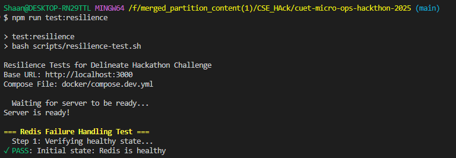

**Circuit Breaker States:**

- `ok` - S3 operations normal
- `circuit_open` - S3 failing, fast-fail mode (30s)
- `error` - Connection error

---

## Security Features

- Request ID tracking for distributed tracing
- Rate limiting with configurable windows
- Security headers (HSTS, X-Frame-Options, etc.)
- CORS configuration
- Input validation with Zod schemas
- Path traversal prevention for S3 keys
- Graceful shutdown handling
- CodeQL security scanning in CI
- npm audit for dependency vulnerabilities

---

## Docker Services

### Development (`compose.dev.yml`)

| Service             | Port(s)     | Description                   |
| ------------------- | ----------- | ----------------------------- |
| delineate-app       | 3000        | Main API server               |
| delineate-dashboard | 5173        | React observability dashboard |
| delineate-jaeger    | 16686, 4318 | Jaeger tracing UI & collector |
| redis               | 6379        | Job queue (BullMQ)            |
| rustfs              | 9000, 9001  | S3-compatible storage         |
| rustfs-init         | -           | Bucket initialization         |

### Production (`compose.prod.yml`)

| Service             | Port | Description                      |
| ------------------- | ---- | -------------------------------- |
| delineate-gateway   | 80   | nginx API gateway                |
| delineate-app       | -    | Main API server (internal)       |
| delineate-dashboard | -    | React dashboard (internal)       |
| rustfs              | -    | S3-compatible storage (internal) |
| rustfs-init         | -    | Bucket initialization            |

---

## Deliverables Checklist

### Challenge 1: S3 Storage Integration

- [x] Add S3-compatible storage service (RustFS) to Docker Compose
- [x] Create `downloads` bucket on startup
- [x] Configure proper networking between services
- [x] Update environment variables for API connectivity
- [x] Pass all E2E tests (`npm run test:e2e`)
- [x] Health endpoint returns `{"status": "healthy", "checks": {"storage": "ok"}}`

### Challenge 2: Architecture Design

- [x] `ARCHITECTURE.md` document created
- [x] Architecture diagrams (high-level, fast path, slow path)
- [x] Technical approach with pattern justification
- [x] API contract changes documented
- [x] Database/cache schema (Redis)
- [x] Background job processing (BullMQ)
- [x] Error handling and retry logic
- [x] Timeout configuration at each layer
- [x] Proxy configuration (Cloudflare, nginx, AWS ALB)
- [x] Frontend integration (React hooks, components)

### Challenge 3: CI/CD Pipeline

- [x] `.github/workflows/ci.yml` configuration
- [x] Trigger on push to `main`/`master`/`dev`
- [x] Trigger on pull requests
- [x] Run linting (`npm run lint`)
- [x] Run format check (`npm run format:check`)
- [x] Run E2E tests (`npm run test:e2e`)
- [x] Build Docker image
- [x] Cache dependencies for faster builds
- [x] Fail fast on errors
- [x] Security scanning (CodeQL, npm audit)
- [x] CI badge in README

### Challenge 4: Observability Dashboard

- [x] React application in `frontend/` directory
- [x] Sentry integration (error boundary, automatic capture)
- [x] OpenTelemetry integration (trace propagation)
- [x] Health Status display
- [x] Download Jobs tracking
- [x] Error Log viewer
- [x] Trace Viewer (Jaeger link)
- [x] Performance Metrics
- [x] Docker Compose includes frontend & Jaeger
- [x] Documentation for setup

---

## Documentation

### Project Documentation

| Document | Description |
|----------|-------------|
| [`ARCHITECTURE.md`](./ARCHITECTURE.md) | Complete architecture design for long-running downloads |
| [`SUBMISSION.md`](./SUBMISSION.md) | Hackathon submission summary and deliverables |
| [`README(Given).md`](./README(Given).md) | Original hackathon challenge requirements |

### Challenge-Specific Documentation

| Document | Description |
|----------|-------------|
| [`docs/CHALLENGE-1-COMPLETE.md`](./docs/CHALLENGE-1-COMPLETE.md) | Challenge 1: S3 Storage Integration - Complete guide |
| [`docs/CHALLENGE-2-COMPLETE.md`](./docs/CHALLENGE-2-COMPLETE.md) | Challenge 2: Long-Running Downloads - Project documentation (API, testing, config) |
| [`docs/CHALLENGE-2-CONCEPTS.md`](./docs/CHALLENGE-2-CONCEPTS.md) | Challenge 2: Conceptual guide (patterns, analogies, architecture) |

### Testing & Operations

| Document | Description |
|----------|-------------|
| [`docs/TESTING_GUIDE.md`](./docs/TESTING_GUIDE.md) | Complete testing instructions and verification steps |
| [`docs/DOWNLOAD_API.md`](./docs/DOWNLOAD_API.md) | Download API documentation |
| [`docs/FUTURE_WORK.md`](./docs/FUTURE_WORK.md) | Production roadmap and future improvements |

---

## Resources

### External Documentation

- [Hono Documentation](https://hono.dev/docs/)
- [Sentry React SDK](https://docs.sentry.io/platforms/javascript/guides/react/)
- [OpenTelemetry JavaScript](https://opentelemetry.io/docs/instrumentation/js/)
- [Jaeger UI](https://www.jaegertracing.io/)
- [RustFS](https://github.com/rustfs/rustfs)
- [W3C Trace Context](https://www.w3.org/TR/trace-context/)

### Hackathon Reference

This project was built for the **CUET Fest 2025 Hackathon** organized by [Delineate](https://github.com/bongodev). See [`README(Given).md`](./README(Given).md) for the original challenge requirements.

---
