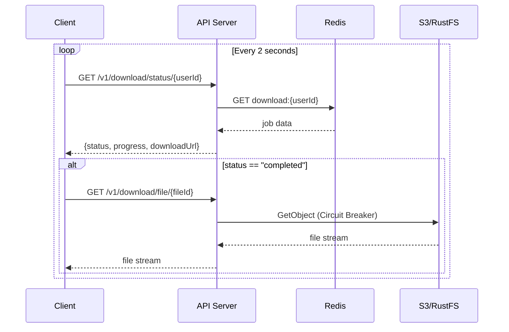
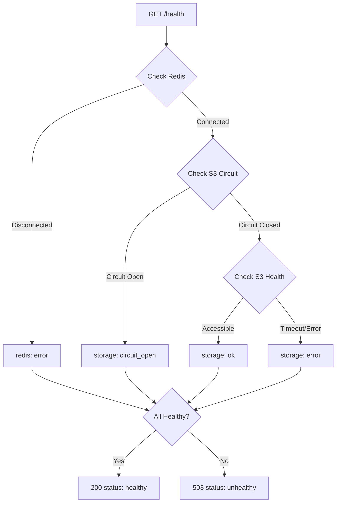

# Long-Running Download Architecture Design

## Table of Contents

1. [Problem Statement](#problem-statement)
2. [Architecture Overview](#architecture-overview)
3. [Tech Stack](#tech-stack)
4. [Project Structure](#project-structure)
5. [Implementation Details](#implementation-details)
6. [API Contracts](#api-contracts)
7. [Observability Stack](#observability-stack)
8. [Docker & Deployment](#docker--deployment)
9. [Frontend Integration](#frontend-integration)
10. [Error Handling & Resilience](#error-handling--resilience)
    - [Circuit Breaker Pattern](#circuit-breaker-pattern-s3-operations)

---

## Problem Statement

The download microservice handles file operations with variable processing times:

```
┌─────────────────────────────────────────────────────────────────────────┐
│                     Download Processing Time                            │
├─────────────────────────────────────────────────────────────────────────┤
│ Fast Downloads    ████████░░░░░░░░░░░░░░░░░░░░░░░░░░░░░░░░   ~5-15s    │
│ Medium Downloads  ████████████████████░░░░░░░░░░░░░░░░░░░░   ~30-60s   │
│ Slow Downloads    ████████████████████████████████████████   ~60-120s  │
└─────────────────────────────────────────────────────────────────────────┘
```

### Critical Issues Behind Reverse Proxies

| Problem             | Impact                                                                   |
| ------------------- | ------------------------------------------------------------------------ |
| Connection Timeouts | Cloudflare (100s), nginx (60s default), AWS ALB (60s) terminate requests |
| Gateway Errors      | Users see 504/502 errors for slow downloads                              |
| Poor UX             | No feedback during 2+ minute waits                                       |
| Resource Exhaustion | Open HTTP connections consume server memory                              |
| Retry Storms        | Dropped connections trigger duplicate processing                         |

### Solution: Async Polling Pattern

This project implements an **async/polling architecture** where:

- Client initiates download → receives `jobId` immediately (< 100ms)
- Background process handles the actual work
- Client polls for status updates with progress feedback
- Redis stores job state with TTL for distributed consistency

---

## Architecture Overview

### High-Level Architecture Diagram (ASCII)

```
┌─────────────────────────────────────────────────────────────────────────────────────┐
│                              FRONTEND (React + Vite) - Port 5173                    │
│  ┌──────────────┐    ┌──────────────┐    ┌──────────────┐    ┌──────────────┐       │
│  │ HealthStatus │    │DownloadTester│    │  FileUpload  │    │ DownloadJobs │       │
│  │   Component  │    │  Component   │    │  Component   │    │  Component   │       │
│  └──────────────┘    └──────────────┘    └──────────────┘    └──────────────┘       │
│                                                                                      │
│  ┌──────────────┐    ┌──────────────┐    ┌──────────────┐    ┌──────────────┐       │
│  │ Performance  │    │  TraceViewer │    │   ErrorLog   │    │ Sentry/OTEL  │       │
│  │   Metrics    │    │  Component   │    │  Component   │    │    Libs      │       │
│  └──────────────┘    └──────────────┘    └──────────────┘    └──────────────┘       │
└────────────────────────────────────────────┬────────────────────────────────────────┘
                                             │
         ┌───────────────────────────────────┼───────────────────────────────────┐
         │                                   │                                   │
         │ POST /v1/download/start           │ GET /v1/download/status/{userId}  │
         │ POST /v1/upload                   │ GET /v1/files                     │
         │ POST /v1/download/check           │ GET /v1/download/file/{fileId}    │
         ▼                                   ▼                                   │
┌─────────────────────────────────────────────────────────────────────────────────────┐
│                              API SERVER (Hono + Node.js) - Port 3000                │
│  ┌─────────────────────────────────────────────────────────────────────────────┐   │
│  │                              Middleware Stack                                │   │
│  │    secureHeaders → CORS → timeout(30s) → rateLimiter → OTEL → Sentry       │   │
│  └─────────────────────────────────────────────────────────────────────────────┘   │
│                                                                                     │
│  ┌─────────────────────────────────────────────────────────────────────────────┐   │
│  │                           Request Handlers                                   │   │
│  │  ┌─────────────┐ ┌─────────────┐ ┌─────────────┐ ┌─────────────┐            │   │
│  │  │ POST        │ │ GET         │ │ POST        │ │ GET         │            │   │
│  │  │ /v1/download│ │ /v1/download│ │ /v1/upload  │ │ /v1/files   │            │   │
│  │  │ /start      │ │ /status/:uid│ │             │ │             │            │   │
│  │  └──────┬──────┘ └──────┬──────┘ └──────┬──────┘ └──────┬──────┘            │   │
│  │         │               │               │               │                   │   │
│  │  ┌─────────────┐ ┌─────────────┐ ┌─────────────┐ ┌─────────────┐            │   │
│  │  │ GET         │ │ POST        │ │ GET         │ │ GET /docs   │            │   │
│  │  │ /v1/download│ │ /v1/download│ │ /health     │ │ /openapi    │            │   │
│  │  │ /file/:id   │ │ /check      │ │             │ │             │            │   │
│  │  └──────┬──────┘ └──────┬──────┘ └──────┬──────┘ └─────────────┘            │   │
│  └─────────┼───────────────┼───────────────┼───────────────────────────────────┘   │
│            │               │               │                                        │
│            ▼               ▼               ▼                                        │
│  ┌─────────────────────────────────────────────────────────────────────────────┐   │
│  │                      Background Job Processor                                │   │
│  │  - Simulated processing delay (5-15s dev, 10-120s prod)                      │   │
│  │  - Progress updates every 1 second to Redis                                  │   │
│  │  - Download URL generation on completion                                     │   │
│  └──────────────────────────────────┬──────────────────────────────────────────┘   │
└─────────────────────────────────────┼───────────────────────────────────────────────┘
                                      │
              ┌───────────────────────┼───────────────────────┐
              │                       │                       │
              ▼                       ▼                       ▼
┌──────────────────────┐  ┌──────────────────────┐  ┌──────────────────────┐
│   Redis (Port 6379)  │  │  S3/RustFS Storage   │  │   Jaeger Tracing     │
│  ┌────────────────┐  │  │  ┌────────────────┐  │  │  ┌────────────────┐  │
│  │ Job Status     │  │  │  │ ┌────────────┐ │  │  │  │ OTLP Receiver  │  │
│  │ - queued       │  │  │  │ │  Circuit   │ │  │  │  │ Port: 4318     │  │
│  │ - processing   │  │  │  │ │  Breaker   │ │  │  │  │                │  │
│  │ - completed    │  │  │  │ │ (Opossum)  │ │  │  │  │ Trace UI       │  │
│  │ - failed       │  │  │  │ │ 5s/30s/50% │ │  │  │  │ Port: 16686    │  │
│  │                │  │  │  │ └──────┬─────┘ │  │  │  │                │  │
│  │ Key: download: │  │  │  │        ▼       │  │  │  │ Console        │  │
│  │ TTL: 1 hour    │  │  │  │ downloads/     │  │  │  │ Port: 9001     │  │
│  │                │  │  │  │ ├── 70000.zip  │  │  │  │                │  │
│  │ 503 on failure │  │  │  │ └── ...        │  │  │  │                │  │
│  └────────────────┘  │  │  └────────────────┘  │  │  └────────────────┘  │
└──────────────────────┘  └──────────────────────┘  └──────────────────────┘
```

#### Download Flow Sequence


#### Status Polling Flow



#### Health Check Flow



## Tech Stack

### Backend

| Technology                 | Version | Purpose                       |
| -------------------------- | ------- | ----------------------------- |
| Node.js                    | 24.10+  | Runtime (ESM modules)         |
| Hono                       | 4.10.8  | Web framework                 |
| @hono/zod-openapi          | 1.1.5   | OpenAPI 3.0 spec generation   |
| @scalar/hono-api-reference | 0.9.28  | Interactive API documentation |
| Zod                        | 4.1.13  | Schema validation             |
| ioredis                    | 5.8.2   | Redis client                  |
| opossum                    | 9.0.0   | Circuit breaker               |
| @aws-sdk/client-s3         | 3.948.0 | S3 operations                 |
| @sentry/node               | 10.30.0 | Error tracking                |
| @opentelemetry/sdk-node    | 0.208.0 | Distributed tracing           |

### Frontend

| Technology                   | Version | Purpose         |
| ---------------------------- | ------- | --------------- |
| React                        | 18.3.1  | UI framework    |
| Vite                         | 6.0.3   | Build tool      |
| Tailwind CSS                 | 3.4.16  | Styling         |
| React Router DOM             | 7.0.2   | Routing         |
| @sentry/react                | 10.30.0 | Error tracking  |
| @opentelemetry/sdk-trace-web | 2.0.0   | Browser tracing |

### Infrastructure

| Technology                | Purpose                           |
| ------------------------- | --------------------------------- |
| Docker & Docker Compose   | Containerization & orchestration  |
| Nginx                     | API gateway / reverse proxy       |
| Redis                     | Job state storage & caching       |
| RustFS (MinIO-compatible) | S3-compatible object storage      |
| Jaeger                    | Distributed trace collection & UI |

---

## Project Structure

```
cuet-micro-ops-hackthon-2025/
├── src/                              # Backend source code
│   ├── index.js                      # Main API server (Hono app)
│   └── instrument.js                 # OpenTelemetry & Sentry init
│
├── frontend/                         # React dashboard
│   ├── src/
│   │   ├── App.tsx                   # Main app with tab navigation
│   │   ├── main.tsx                  # Entry point, observability init
│   │   ├── components/
│   │   │   ├── DownloadTester.tsx    # Download initiation UI
│   │   │   ├── HealthStatus.tsx      # System health display
│   │   │   ├── FileUpload.tsx        # File upload component
│   │   │   ├── DownloadJobs.tsx      # Job history tracker
│   │   │   ├── ErrorLog.tsx          # Error capture & display
│   │   │   ├── PerformanceMetrics.tsx# Response time stats
│   │   │   └── TraceViewer.tsx       # Jaeger trace lookup
│   │   └── lib/
│   │       ├── sentry.ts             # Sentry initialization
│   │       ├── tracing.ts            # OpenTelemetry web setup
│   │       └── uuid.ts               # UUID generation utility
│   ├── Dockerfile                    # Frontend container
│   ├── package.json
│   ├── vite.config.ts
│   └── tailwind.config.js
│
├── docs/                             # Documentation
│   ├── TESTING_GUIDE.md              # Testing instructions
│   ├── DOWNLOAD_API.md               # API documentation
│   ├── CHALLENGE-2-GUIDE.md          # Challenge 2 conceptual guide
│   ├── CHALLENGE-2-IMPLEMENTATION-STATUS.md  # Implementation status
│   └── FUTURE_WORK.md                # Production roadmap
│
├── docker/                           # Docker configurations
│   ├── Dockerfile.dev                # Development backend image
│   ├── Dockerfile.prod               # Production backend image
│   ├── compose.dev.yml               # Development stack
│   └── compose.prod.yml              # Production stack
│
├── scripts/                          # Utility & test scripts
│   ├── run-e2e.js                    # E2E test runner
│   ├── e2e-test.js                   # E2E test suite (45 tests)
│   ├── quick-test.js                 # Quick health verification
│   └── resilience-test.sh            # Redis/S3 failure testing
│
├── .github/workflows/
│   └── ci.yml                        # GitHub Actions CI/CD
│
├── package.json                      # Backend dependencies
├── tsconfig.json                     # TypeScript configuration
├── ARCHITECTURE.md                   # This file
├── SUBMISSION.md                     # Submission documentation
└── .env.example                      # Environment template
```

---

## API Contracts

### OpenAPI Documentation

Interactive API documentation is available at `/docs` (Scalar UI) and raw OpenAPI spec at `/openapi`.

### Endpoints

#### Health Check

```
GET /health

Response 200 (healthy):
{
  "status": "healthy",
  "checks": {
    "storage": "ok",
    "redis": "ok"
  }
}

Response 503 (unhealthy):
{
  "status": "unhealthy",
  "checks": {
    "storage": "circuit_open",  // or "error"
    "redis": "error"
  }
}
```

**Storage Status Values:**

- `ok` - S3 is accessible
- `error` - S3 connection failed
- `circuit_open` - Circuit breaker is open (fast-fail mode)

#### Start Download Job

```
POST /v1/download/start
Content-Type: application/json

Request:
{
  "file_id": 70000,      // File ID (10000 - 100000000)
  "user_id": "user123"   // Unique user ID for idempotency
}

Response 200 (new job):
{
  "jobId": "550e8400-e29b-41d4-a716-446655440000",
  "userId": "user123",
  "fileId": 70000,
  "status": "queued",
  "progress": 0,
  "message": "Download job queued. Processing will begin shortly.",
  "pollUrl": "/v1/download/status/user123"
}

Response 200 (existing job):
{
  "jobId": "existing-job-id",
  "userId": "user123",
  "fileId": 70000,
  "status": "processing",
  "progress": 45,
  "message": "Existing job found. Continue polling for status.",
  "pollUrl": "/v1/download/status/user123"
}
```

#### Check Download Status

```
GET /v1/download/status/{userId}

Response 200 (processing):
{
  "jobId": "550e8400-e29b-41d4-a716-446655440000",
  "status": "processing",
  "progress": 60,
  "createdAt": 1705312200000,
  "updatedAt": 1705312260000,
  "completedAt": null,
  "downloadUrl": null,
  "size": null,
  "processingTimeMs": null,
  "error": null
}

Response 200 (completed):
{
  "jobId": "550e8400-e29b-41d4-a716-446655440000",
  "status": "completed",
  "progress": 100,
  "createdAt": 1705312200000,
  "updatedAt": 1705312320000,
  "completedAt": 1705312320000,
  "downloadUrl": "https://s3.../downloads/70000.zip?...",
  "size": 1048576,
  "processingTimeMs": 120000,
  "error": null
}

Response 404:
{
  "error": "Job not found for user: user123"
}
```

#### Check File Availability

```
POST /v1/download/check
Content-Type: application/json

Request:
{
  "file_id": 70000
}

Response 200:
{
  "available": true,
  "file_id": 70000,
  "message": "File is available for download"
}
```

#### Initiate Batch Download

```
POST /v1/download/initiate
Content-Type: application/json

Request:
{
  "file_ids": [10000, 20000, 30000]
}

Response 200:
{
  "jobId": "550e8400-e29b-41d4-a716-446655440000",
  "status": "queued",
  "totalFileIds": 3
}
```

#### Download File

```
GET /v1/download/file/{fileId}

Response 200:
- Returns file stream with appropriate headers
- Content-Disposition: attachment; filename="original-name.zip"
- Content-Type: application/octet-stream

Response 404:
{
  "error": "Not Found",
  "message": "File not found in storage"
}

Response 503 (Circuit Open):
{
  "error": "Service Unavailable",
  "message": "Storage service temporarily unavailable"
}
```

#### Upload File

```
POST /v1/upload
Content-Type: multipart/form-data

Form Fields:
- file: File to upload (required)
- file_id: File ID 10000-100000000 (required)

Response 200:
{
  "success": true,
  "fileId": 70000,
  "s3Key": "downloads/70000.zip",
  "size": 1234,
  "message": "File uploaded successfully as downloads/70000.zip"
}

Response 503:
{
  "error": "Service Unavailable",
  "message": "Storage service temporarily unavailable"
}
```

#### List Files

```
GET /v1/files

Response 200:
{
  "files": [
    {
      "key": "downloads/70000.zip",
      "size": 1234,
      "lastModified": "2024-12-16T10:30:00.000Z",
      "fileId": 70000
    }
  ],
  "totalCount": 1
}
```

---

### Make Commands

```bash
# Development
make dev-up       # Start development stack
make dev-down     # Stop services
make dev-clean    # Remove containers and volumes
make dev-logs     # View logs (follow mode)
make dev-ps       # Show running containers

# Production
make prod-up      # Start production stack (with Nginx)
make prod-down    # Stop services
make prod-clean   # Full cleanup
make prod-logs    # View logs (follow mode)
make prod-ps      # Show running containers

# Testing
make test         # Run quick + E2E tests
make test-quick   # Quick health verification (~5s)
make test-e2e     # Full E2E suite (~30s)
make test-resilience  # Redis/S3 failure tests (~2min)

# Code Quality
make lint         # Run ESLint
make lint-fix     # Fix linting issues
make format       # Format code with Prettier
make format-check # Check code formatting

# Setup
make install      # Install npm dependencies
make help         # Show all available commands
```

---

## Frontend Integration

### Component Architecture

```
App.tsx
├── Tab Navigation (Dashboard | Downloads | Traces)
│
├── Dashboard Tab
│   ├── HealthStatus.tsx      # Polls /health every 30s
│   ├── DownloadTester.tsx    # Main download UI
│   ├── PerformanceMetrics.tsx # Calculated from session data
│   └── ErrorLog.tsx          # Error capture & display
│
├── Downloads Tab
│   └── DownloadJobs.tsx      # Job history list
│
└── Traces Tab
    └── TraceViewer.tsx       # Jaeger UI link & trace lookup
```


## Error Handling & Resilience

### Circuit Breaker Pattern (S3 Operations)

The system uses the **Opossum** library to implement a circuit breaker for S3 operations, preventing cascade failures when storage is unavailable.

```
┌─────────────────────────────────────────────────────────────────────────┐
│                      Circuit Breaker States                              │
├─────────────────────────────────────────────────────────────────────────┤
│                                                                         │
│   ┌──────────┐         50% failures         ┌──────────┐               │
│   │  CLOSED  │ ──────────────────────────▶  │   OPEN   │               │
│   │ (normal) │                              │(fast-fail)│               │
│   └────┬─────┘                              └─────┬─────┘               │
│        │                                          │                     │
│        │                                          │ after 30s           │
│        │                                          ▼                     │
│        │                                    ┌───────────┐               │
│        │         success                    │HALF-OPEN  │               │
│        │◀───────────────────────────────────│  (test)   │               │
│        │                                    └───────────┘               │
│                                                                         │
└─────────────────────────────────────────────────────────────────────────┘
```

#### Circuit States in Health Response

```json
{
  "status": "healthy",
  "checks": {
    "storage": "ok",           // Normal operation
    "redis": "ok"
  }
}

{
  "status": "unhealthy",
  "checks": {
    "storage": "circuit_open", // Circuit breaker is open
    "redis": "ok"
  }
}
```

---

### Error Codes

| Code               | HTTP Status | Description                 | Client Action                  |
| ------------------ | ----------- | --------------------------- | ------------------------------ |
| `JOB_NOT_FOUND`    | 404         | Job ID doesn't exist        | Show error, allow new download |
| `INVALID_FILE_ID`  | 400         | File ID out of range        | Show validation error          |
| `RATE_LIMITED`     | 429         | Too many requests           | Retry after delay              |
| `STORAGE_ERROR`    | 503         | S3/storage unavailable      | Retry with backoff             |
| `PROCESSING_ERROR` | 500         | Internal processing failure | Retry, then fail               |
| `TIMEOUT`          | 504         | Request timeout             | Use polling pattern            |

### Backend Error Handler

```typescript
app.onError((err, c) => {
  console.error("Unhandled error:", err);

  // Capture in Sentry
  Sentry.captureException(err, {
    tags: {
      requestId: c.req.header("x-request-id"),
      path: c.req.path,
    },
  });

  return c.json(
    {
      error: "Internal server error",
      message: NODE_ENV === "development" ? err.message : undefined,
      traceId: c.res.headers.get("x-trace-id"),
    },
    500,
  );
});
```

### Frontend Error Boundary

```tsx
// ErrorLog.tsx captures and displays errors

function ErrorLog() {
  const [errors, setErrors] = useState<ErrorEntry[]>([]);

  useEffect(() => {
    const handler = (event: ErrorEvent) => {
      const entry = {
        message: event.message,
        timestamp: Date.now(),
        traceId: sessionStorage.getItem("lastTraceId"),
      };

      setErrors((prev) => [entry, ...prev].slice(0, 100));

      // Report to Sentry
      Sentry.captureException(event.error, {
        tags: { traceId: entry.traceId },
      });
    };

    window.addEventListener("error", handler);
    return () => window.removeEventListener("error", handler);
  }, []);

  return (
    <div>
      {errors.map((err, i) => (
        <div key={i}>
          <span>{err.message}</span>
          <span>Trace: {err.traceId}</span>
        </div>
      ))}
    </div>
  );
}
```

### Idempotency

The download system is idempotent using `user_id`:

```typescript
// If job exists for user, return existing job instead of creating new one
const existingJob = await redis.get(`download:${userId}`);
if (existingJob) {
  const job = JSON.parse(existingJob);
  if (job.status !== "completed" && job.status !== "failed") {
    return c.json({
      ...job,
      message: "Existing job found. Continue polling for status.",
    });
  }
}
```
---

## Summary

This architecture addresses the core problem of long-running downloads by:

1. **Immediate Response**: `/v1/download/start` returns instantly with a job ID
2. **Async Processing**: Background processor handles actual file operations
3. **Progress Tracking**: Real-time progress updates via polling
4. **Proxy Compatible**: All endpoints complete within proxy timeout limits
5. **Idempotent**: Same `user_id` returns existing job (no duplicates)
6. **Observable**: Full distributed tracing with Jaeger + error tracking with Sentry
7. **Resilient**: Redis-backed state survives server restarts

### Key Design Patterns

| Pattern             | Implementation                                    |
| ------------------- | ------------------------------------------------- |
| Async Polling       | Start job → poll status → get result              |
| Circuit Breaker     | Opossum library for S3 resilience (5s/30s/50%)    |
| Idempotency Key     | `user_id` prevents duplicate job creation         |
| Request ID Tracing  | X-Request-ID header across all services           |
| Distributed Tracing | OpenTelemetry spans propagate context             |
| Error Correlation   | Sentry errors tagged with trace IDs               |
| Health Checks       | HTTP `/health` + Docker HEALTHCHECK               |
| Graceful Shutdown   | SIGTERM/SIGINT handlers clean up resources        |
| Rate Limiting       | Per-IP request throttling via middleware          |
| Redis Job Storage   | Jobs stored with 1 hour TTL, 503 on Redis failure |

### Environment Configuration

Key environment variables (see `.env.example`):

```bash
# Server
NODE_ENV=development|production
PORT=3000

# S3 Storage
S3_ENDPOINT=http://rustfs:9000
S3_BUCKET_NAME=downloads
S3_ACCESS_KEY_ID=minioadmin
S3_SECRET_ACCESS_KEY=minioadmin

# Download Simulation
DOWNLOAD_DELAY_ENABLED=true
DOWNLOAD_DELAY_MIN_MS=5000   # Dev: 5s, Prod: 10s
DOWNLOAD_DELAY_MAX_MS=15000  # Dev: 15s, Prod: 120s

# Observability
SENTRY_DSN=https://...@sentry.io/...
OTEL_EXPORTER_OTLP_ENDPOINT=http://jaeger:4318

# Redis
REDIS_URL=redis://redis:6379
REDIS_JOB_TTL_SECONDS=3600
REDIS_KEY_PREFIX=download:

# Security
RATE_LIMIT_WINDOW_MS=60000
RATE_LIMIT_MAX_REQUESTS=100
REQUEST_TIMEOUT_MS=30000
CORS_ORIGINS=*
```
